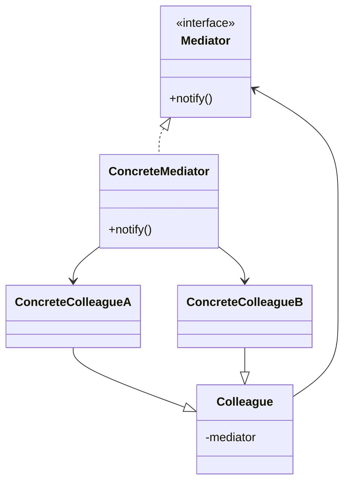

**Data:** 2026-03-04
**Link**: [C# - Apresentando o padrão Mediator](https://www.youtube.com/watch?v=YM9lbsq4H5s&list=PLJ4k1IC8GhW1L7fOWe238fetknEfBmG1I&index=22)
**Curso:** Padrões de Projeto
**Professor**: #Jose-Carlos-Macoratti
**Instituição:** #youtube 

**Tags:** #Padrões-Projetos #Programação #Código-Limpo #Boas-Praticas

### Conteúdo
----------------
## Definição

O **Mediator** é um padrão de projeto comportamental cujo objetivo é **encapsular a forma como um conjunto de objetos interage**, centralizando essa comunicação em um objeto mediador.

Em vez de objetos se comunicarem diretamente entre si, toda comunicação passa por uma **classe mediadora**, que coordena as interações entre eles. Dessa forma, os objetos deixam de depender uns dos outros e passam a depender apenas do mediador.

Esse padrão é utilizado para **reduzir o acoplamento entre objetos**, tornando o sistema mais modular e mais fácil de manter ou evoluir.

Sem o Mediator, cada objeto precisaria conhecer e manter referências para vários outros objetos com os quais precisa interagir. Em sistemas maiores isso cria uma **rede complexa de dependências**, dificultando manutenção e evolução do código.

O Mediator resolve esse problema criando um **ponto central de comunicação**, responsável por receber mensagens de um objeto e direcioná-las ao destino apropriado.

---

## Diagrama UML

---

## Funcionamento e Conceitos

### Como o padrão funciona

- Um **objeto mediador** é introduzido para coordenar a comunicação entre vários objetos.    
- Os objetos participantes (colleagues) **não se comunicam diretamente entre si**.    
- Sempre que um objeto precisa interagir com outro, ele envia a mensagem ao mediador.    
- O mediador recebe essa mensagem e **decide para qual objeto ela deve ser encaminhada**.    
- Assim, cada objeto conhece apenas o mediador, e não os demais objetos do sistema.    

Esse mecanismo transforma múltiplas relações **muitos-para-muitos** entre objetos em uma estrutura mais simples **um-para-muitos**.

---

### Papéis e responsabilidades dos participantes

**Mediator**

- Define a interface de comunicação entre os objetos.    
- Declara os métodos usados pelos colegas para enviar notificações ou mensagens.    

**ConcreteMediator**

- Implementa a lógica de comunicação entre os objetos.    
- Mantém referências aos objetos participantes.    
- Decide como as mensagens devem ser distribuídas.    

**Colleague**

- Classe base (geralmente abstrata) para os objetos que participam da comunicação.    
- Mantém uma referência ao mediador.    

**ConcreteColleague**

- Implementações concretas dos objetos participantes.    
- Sempre que precisam interagir com outros objetos, utilizam o mediador.    

---

### Quando utilizar

O padrão Mediator é indicado quando:

- Existe **grande quantidade de interações entre objetos**.    
- Os objetos estão **fortemente acoplados entre si**.    
- Mudanças em um objeto acabam impactando vários outros.    
- O sistema possui **muitos relacionamentos entre componentes** e precisa de um ponto central de controle.    
- Você deseja **alterar o comportamento de colaboração entre objetos sem modificar as classes participantes**.    

---

### Pontos importantes destacados na aula

- O padrão foi criado para resolver o problema de **forte acoplamento entre objetos que precisam se comunicar frequentemente**.    
- Cada objeto passa a ter **uma responsabilidade mais clara**, focada apenas em sua própria lógica.    
- A comunicação é **centralizada no mediador**, simplificando a estrutura de dependências.    
- Um exemplo didático apresentado é o de **grupos de mensagens (como um grupo de rede social)**, onde um mediador recebe uma mensagem e a distribui aos membros.    

---

### Observações práticas relevantes para C'#'#

- Em aplicações C#, o mediador normalmente é representado por:    
    - **Interface** ou **classe abstrata**.
        
- As classes participantes recebem o mediador geralmente:    
    - via **construtor** (injeção de dependência).
        
- O mediador frequentemente mantém:    
    - uma **coleção de objetos participantes**.
        
- Esse padrão é bastante útil em:    
    - interfaces gráficas (coordenação de componentes UI),        
    - sistemas de mensagens,        
    - comunicação entre módulos de um sistema.        

---

## Vantagens e Desvantagens

### Vantagens

**Redução do acoplamento**
- Objetos não precisam conhecer uns aos outros.    

**Centralização da comunicação**
- A lógica de interação fica concentrada em um único lugar.    

**Facilidade de manutenção**
- Mudanças nas interações não exigem alterações nos objetos participantes.    

**Simplificação das relações**
- Substitui múltiplas dependências entre objetos por um relacionamento mais simples.    

**Maior reutilização**
- Componentes podem ser reutilizados em outros contextos com mediadores diferentes.    

---
### Desvantagens

**Risco de excesso de responsabilidade**
- O mediador pode se tornar uma classe muito complexa.    

**Possível gargalo**
- Como toda comunicação passa pelo mediador, ele pode se tornar um ponto crítico de desempenho.    

**Acúmulo de lógica**
- Com o crescimento do sistema, o mediador pode evoluir para uma espécie de **“Objeto Deus”**, concentrando muitas responsabilidades.    

### Complementos externos
---------
