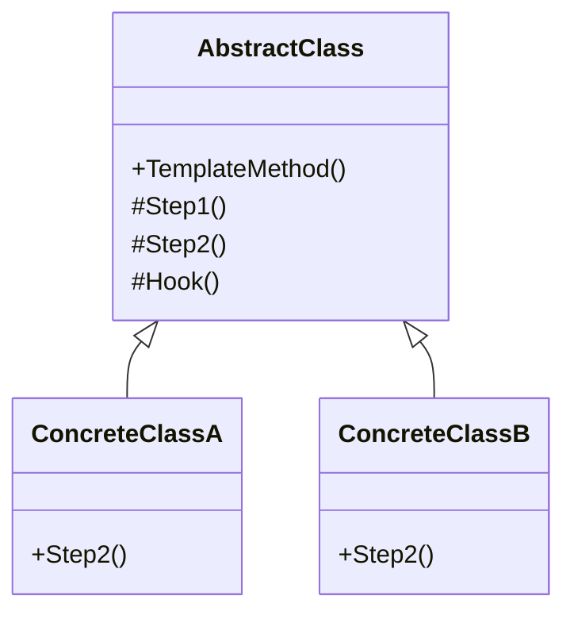

**Data:** 2026-03-23
**Link**: [C# - Apresentando o padrão Template Method](https://www.youtube.com/watch?v=MIGpVFDlWP4&list=PLJ4k1IC8GhW1L7fOWe238fetknEfBmG1I&index=27)
**Curso:** Padrões de Projeto
**Professor**: #Jose-Carlos-Macoratti
**Instituição:** #youtube 

**Tags:** #Padrões-Projetos #Programação #Código-Limpo #Boas-Praticas

### Conteúdo
----------------
## Definição

O **Template Method** é um padrão comportamental que **define o esqueleto de um algoritmo em uma classe base**, permitindo que **subclasses implementem ou sobrescrevam etapas específicas**, sem alterar a estrutura geral do algoritmo.

A ideia central é **centralizar o fluxo do algoritmo na classe abstrata** e delegar apenas os pontos de variação para as subclasses.

Esse padrão resolve principalmente:

- **Duplicação de código** entre algoritmos semelhantes    
- **Falta de padronização no fluxo de execução**    
- **Dificuldade de manutenção quando a lógica se repete em várias classes**    

Na prática, você define o "passo a passo" fixo e permite variações apenas em partes específicas.

---

## Diagrama UML

---

## Funcionamento e Conceitos

### Como o padrão funciona

- A **classe abstrata**:
    
    - Define o **Template Method** (método principal)        
    - Controla a **ordem de execução das etapas**        
    - Pode conter:
        
        - Métodos concretos (implementação padrão)            
        - Métodos abstratos (obrigatórios para subclasses)            
        - Hooks (pontos opcionais de extensão)
            
- As **subclasses**:
    
    - Implementam apenas as partes que variam        
    - Não alteram a estrutura do algoritmo        

---

### Papéis e responsabilidades

- **AbstractClass**
    
    - Define o algoritmo (template)        
    - Implementa partes comuns        
    - Declara métodos abstratos
        
- **ConcreteClass**
    
    - Implementa os passos específicos        
    - Personaliza o comportamento do algoritmo        

---

### Quando utilizar

- Quando vários algoritmos:
    
    - Seguem **os mesmos passos**        
    - Mas possuem **pequenas variações**
        
- Quando deseja:
    
    - Evitar duplicação de código        
    - Garantir um fluxo padrão de execução        
    - Permitir extensão controlada
        
- Quando quer:
    
    - Padronizar processos (ex: fluxo de processamento, validação, execução)        

---

### Pontos importantes destacados na aula

- O padrão **define a ordem fixa dos passos** do algoritmo    
- A classe base pode fornecer **implementações padrão** para etapas comuns    
- Subclasses **sobrescrevem apenas o necessário**    
- O cliente **não controla o fluxo**, ele apenas usa o algoritmo pronto    
- Evita duplicação ao centralizar lógica comum na classe abstrata    

---

### Observações práticas (C#)

- Muito comum em:
    
    - Classes base abstratas de serviços        
    - Processamentos com etapas fixas (pipeline)        
    - Frameworks e bibliotecas
        
- Em C#, normalmente:
    
    - O Template Method pode ser `virtual` ou `non-virtual`        
    - Métodos abstratos definem obrigatoriedade        
    - Métodos protegidos (`protected`) são usados para etapas
        
- Excelente para:
    
    - Padronizar fluxos em sistemas corporativos (como seu ECM)        
    - Criar "framework interno" reutilizável        

---

## Vantagens e Desvantagens

### Vantagens

- Elimina duplicação de código    
- Padroniza o fluxo do algoritmo    
- Facilita manutenção    
- Permite extensão controlada    
- Reutilização de lógica comum    

---

### Desvantagens

- Pode aumentar a complexidade da hierarquia    
- Fluxo pode ficar difícil de entender (principalmente com muitas etapas)    
- Forte acoplamento com herança    
- Alterações na classe base podem impactar todas as subclasses    

---

Se quiser, posso te mostrar um **exemplo prático aplicado ao seu cenário de ECM (fluxo de documentos, assinatura, etc.)**, que é onde esse padrão brilha bastante.

### Complementos externos
---------
