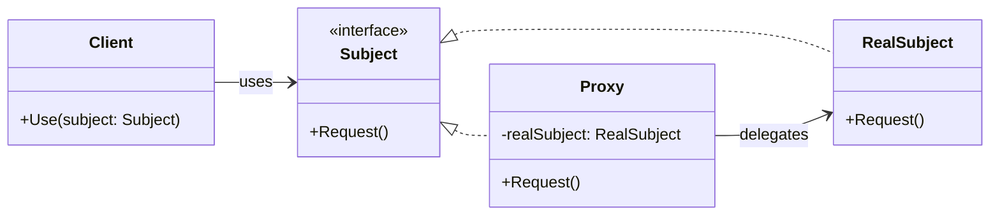

**Data:** 2026-02-18
**Link**:
**Curso:** Padrões de Projeto
**Professor**: #Jose-Carlos-Macoratti
**Instituição:** #youtube 

**Tags:** #Padrões-Projetos #Programação #Código-Limpo #Boas-Praticas

### Conteúdo
----------------
# Padrão Estrutural – Proxy

## Definição

O **Proxy** é um padrão de projeto estrutural que fornece um objeto substituto para outro objeto real, controlando o acesso a ele.

Ele atua “no lugar de” (em nome de) um objeto principal, mantendo a **mesma interface** do objeto real, permitindo que o cliente utilize o proxy como se estivesse utilizando o próprio objeto original.

Seu principal objetivo é:

- Controlar o acesso a um objeto    
- Adiar sua criação (inicialização preguiçosa)    
- Adicionar comportamentos antes ou depois da chamada    
- Proteger recursos sensíveis    
- Intermediar acesso remoto    

Como destacado na aula, o proxy **encapsula uma instância de uma classe complexa usando outra classe com a mesma interface**, permitindo controlar criação, acesso e ciclo de vida do objeto real.

O material complementar reforça que o proxy permite executar algo antes ou depois da chamada ao objeto real, sem modificar a classe original

---
## Diagrama UML

---
## Funcionamento e Conceitos

### Como o padrão funciona

- O cliente depende de uma **interface comum (Subject)**.    
- O **RealSubject** implementa a lógica real.    
- O **Proxy** também implementa a mesma interface.    
- O proxy mantém uma referência ao objeto real.    
- Ao receber uma requisição:
    
    - Pode executar validações, autenticação, cache, logs etc.        
    - Depois delega a chamada ao objeto real.
        
- O cliente não sabe se está utilizando o objeto real ou o proxy.    

---
### Papéis e responsabilidades

#### Subject (Interface)

- Define o contrato comum.    
- Permite intercambialidade entre Proxy e RealSubject.    
#### RealSubject

- Implementa a lógica de negócio real.    
- Pode ser pesado, sensível ou remoto.    
#### Proxy

- Mantém referência ao RealSubject.    
- Controla acesso.    
- Pode criar o objeto real sob demanda.    
- Pode gerenciar ciclo de vida.    
- Pode aplicar autenticação, cache, logging etc.    

#### Client

- Trabalha sempre contra a abstração.    
- Não conhece detalhes internos.    

---
### Analogia apresentada na aula

A aula utiliza exemplos bem didáticos:

- **Cheque ou cartão de crédito** como proxy da conta bancária.    
- **Servidor proxy na internet**, que atua como intermediário entre cliente e recurso.    

Em ambos os casos, há um objeto intermediário que representa outro e controla seu acesso.

---
### Tipos principais de Proxy

Conforme destacado na aula:
#### 1. Proxy Virtual

- Usado quando o objeto real é pesado.    
- Criação ocorre apenas quando necessário.    
- Implementa inicialização sob demanda.    
#### 2. Proxy Remoto

- Representa um objeto localizado em outro espaço de endereço.    
- Muito comum em serviços web e microsserviços.    
- Intermedia comunicação via rede.    
#### 3. Proxy de Proteção

- Controla acesso com base em permissões.    
- Implementa autenticação/autorização.    
- O cliente só acessa o objeto real se tiver permissão.    

O exemplo prático da aula demonstra claramente um **Proxy de Proteção**, controlando acesso a uma pasta compartilhada com base no perfil do usuário.

O material complementar também adiciona outros usos comuns:

- Proxy de cache    
- Proxy de registro (logging)    
- Referência inteligente
---
### Quando utilizar

Use o Proxy quando:

- A criação do objeto é custosa.    
- O objeto consome muitos recursos.    
- É necessário controlar acesso a dados sensíveis.    
- É preciso intermediar acesso a serviço remoto.    
- Você precisa adicionar comportamento sem modificar a classe original.    
- Deseja implementar cache transparente ao cliente.    

---
### Pontos importantes destacados na aula

- Proxy e Adapter possuem estrutura semelhante, mas propósitos diferentes.
    
    - **Adapter** altera a interface.        
    - **Proxy** mantém a mesma interface.
    
- O proxy pode:
    
    - Criar e destruir o objeto real.        
    - Controlar completamente o acesso.
    
- Cliente não deve acessar diretamente o RealSubject.    
- A decisão de usar proxy deve ser arquitetural, não improvisada.    

---
### Observações práticas no contexto C#

No desenvolvimento em C#:

- O uso de **interfaces é essencial** para permitir substituição.    
- Pode ser aplicado em:
    
    - Controle de acesso em APIs        
    - Lazy loading        
    - Cache em chamadas HTTP        
    - Integração com serviços externos
    - 
- Muito comum em ORMs (lazy loading de entidades).    
- Pode ser combinado com Injeção de Dependência.    
- É importante evitar que alguns clientes usem diretamente o RealSubject enquanto outros usem o Proxy (isso pode gerar inconsistências).
    

---
## Vantagens e Desvantagens

### Vantagens

- Controle total sobre acesso ao objeto.    
- Permite lazy initialization.    
- Pode melhorar desempenho via cache.    
- Encapsula complexidade.    
- Protege recursos sensíveis.    
- Permite adicionar comportamento sem alterar a classe original.    
- Segue o princípio Aberto/Fechado.    

---
### Desvantagens

- Introduz mais uma camada de abstração.    
- Pode aumentar complexidade da solução.    
- Pode introduzir pequena sobrecarga de desempenho.    
- Implementação pode se tornar complexa dependendo do cenário.    
- Risco de uso incorreto se o objeto real for acessado diretamente.    

---
## Diferença em relação a padrões semelhantes

- **Proxy vs Adapter**
    
    - Adapter altera a interface.        
    - Proxy mantém a mesma interface   
        
- **Proxy vs Decorator**
    
    - Estrutura parecida.        
    - Decorator adiciona responsabilidades.        
    - Proxy controla acesso.
        
- **Proxy vs Facade**
    
    - Facade simplifica interface.        
    - Proxy mantém interface idêntica e controla acesso.        

---
## Conclusão

O Proxy é um padrão extremamente útil quando precisamos de **controle, proteção ou otimização de acesso** a objetos.

Ele é simples estruturalmente, mas poderoso arquiteturalmente.  
Quando bem aplicado, melhora desempenho, segurança e organização do código — especialmente em cenários de:

- Recursos pesados    
- Serviços remotos    
- Controle de acesso    
- Cache    

É um padrão que, embora estruturalmente simples, exige decisão arquitetural consciente para evitar complexidade desnecessária.
### Complementos externos
---------
