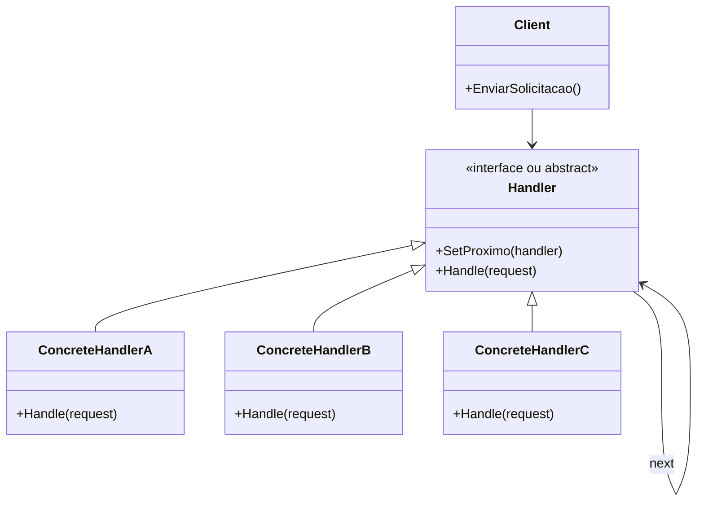

**Data:** 2026-02-21
**Link**: [C# - Apresentando o padrão Chain of Responsability](https://www.youtube.com/watch?v=0vQviUDhxuE&list=PLJ4k1IC8GhW1L7fOWe238fetknEfBmG1I&index=16)
**Curso:** Padrões de Projeto
**Professor**: #Jose-Carlos-Macoratti
**Instituição:** #youtube 

**Tags:** #Padrões-Projetos #Programação #Código-Limpo #Boas-Praticas

### Conteúdo
----------------
## Definição

O **Chain of Responsibility** é um padrão comportamental que **evita acoplar o remetente de uma solicitação ao seu receptor**, dando a **mais de um objeto a chance de tratar a requisição**.

A ideia central é criar uma **cadeia de objetos manipuladores (handlers)** onde:

- Cada objeto recebe a solicitação.    
- Decide se pode tratá-la.    
- Caso não possa, encaminha ao próximo da cadeia.    
- O processo continua até que:    
    - A solicitação seja tratada, ou        
    - A cadeia termine sem tratamento.        

Segundo a aula, o padrão simplifica as interconexões entre objetos e evita dependência direta entre quem solicita e quem executa .

O material complementar reforça que o pedido percorre sequencialmente uma corrente de handlers, e cada um decide se processa ou repassa adiante .

Um exemplo prático citado na aula é o **pipeline de middlewares do ASP.NET Core**, que implementa claramente essa ideia de encadeamento.

---
## Diagrama UML

---
## Funcionamento e Conceitos

### Como o padrão funciona

- O cliente envia uma solicitação para o primeiro manipulador da cadeia.    
- Cada manipulador:    
    - Verifica se está apto a tratar a solicitação.        
    - Se puder, processa e encerra o fluxo.        
    - Caso contrário, encaminha ao próximo.        
- O último manipulador pode:    
    - Tratar a solicitação.        
    - Ou realizar um tratamento alternativo (ex: log, exceção, mensagem de erro).        

A aula destaca que, **uma vez tratada a solicitação, ela não deve continuar sendo propagada** .

---
### Papéis e responsabilidades

**Client**

- Inicia a solicitação.    
- Normalmente conhece apenas o primeiro handler.    

**Handler (interface ou classe abstrata)**

- Define o contrato para tratamento.    
- Mantém referência para o próximo manipulador.    
- Pode implementar comportamento padrão de encaminhamento.    

**Concrete Handlers**

- Implementam a lógica específica.    
- Decidem:    
    - Se tratam.        
    - Se repassam.        
    - Se interrompem a cadeia.        

---
### Quando utilizar

De acordo com a aula, utilize quando :

- Houver **mais de um manipulador possível** para a mesma solicitação.    
- O conjunto de manipuladores **variar dinamicamente**.    
- For necessário manter **flexibilidade na atribuição de responsabilidades**.    
- Houver uma **sequência lógica de processamento** repetida diversas vezes.    
- Desejar reduzir acoplamento entre quem solicita e quem executa.    

O material complementar acrescenta que é útil quando:

- O tipo exato de requisição não é totalmente conhecido antecipadamente.    
- A ordem de execução dos manipuladores é relevante .    

---
### Pontos importantes destacados na aula

- A cadeia precisa ser **montada explicitamente**.    
- Se a cadeia não for configurada corretamente, o padrão não funciona.    
- Pode haver situações onde **nenhum manipulador trata a solicitação**.    
- O último elemento da cadeia pode realizar um tratamento especial.    
- O padrão aplica:    
    - **SRP (Single Responsibility Principle)**.        
    - **OCP (Open/Closed Principle)** .        

Exemplos apresentados na aula:

- Caixa eletrônico com manipuladores de notas.   
- Hierarquia organizacional para aprovação de licenças.    
- Pipeline de middlewares.    

---
### Observações práticas no contexto C#

- Muito comum em:
    
    - Middlewares do ASP.NET Core.        
    - Filtros de requisição.        
    - Validações encadeadas.        
    - Autorização baseada em regras hierárquicas.        
    
- Pode ser implementado usando:
    
    - Interfaces ou classes abstratas.        
    - Injeção de dependência para montar a cadeia.
        
- É importante definir claramente:
    
    - Se apenas um handler pode tratar.        
    - Ou se todos podem processar parcialmente (modo pipeline).
        

Cuidado:

- Cadeias muito longas podem dificultar rastreamento.    
- Debug pode se tornar mais complexo devido ao encadeamento dinâmico.    

---
## Vantagens e Desvantagens

### Vantagens

- Controla a **ordem de tratamento**.    
- Reduz acoplamento entre cliente e executores.    
- Facilita adição de novos manipuladores (OCP).    
- Permite alterar responsabilidades dinamicamente.    
- Aplica o princípio da responsabilidade única (SRP).    
- Alta extensibilidade.    

---
### Desvantagens

- Algumas solicitações podem não ser tratadas.    
- Pode haver dificuldade de rastrear fluxo em tempo de execução.    
- Configuração incorreta da cadeia compromete o funcionamento.    
- Pode introduzir complexidade desnecessária em cenários simples.    

---
## Resumo Conceitual

O Chain of Responsibility é ideal quando queremos **flexibilidade, desacoplamento e extensibilidade no processamento de solicitações**.

Ele é especialmente útil em arquiteturas modernas baseadas em pipeline (como ASP.NET Core), onde o processamento sequencial e configurável é essencial.

A grande força do padrão está em permitir que o sistema cresça com novos manipuladores **sem alterar o código do cliente**, mantendo o design aberto para extensão e fechado para modificação.

### Complementos externos
---------
