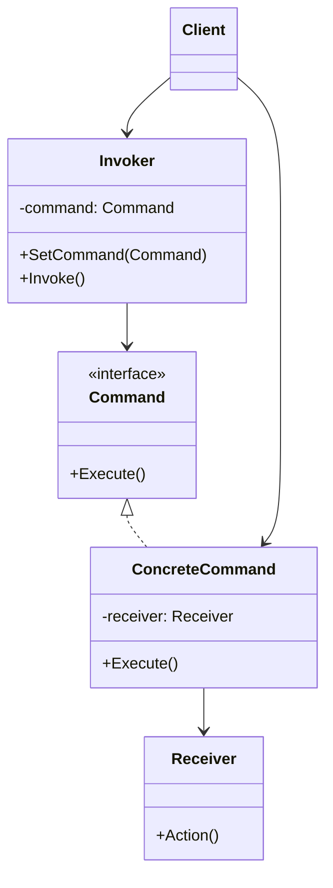

**Data:** 2026-02-23
**Link**:
**Curso:** Padrões de Projeto
**Professor**: #Jose-Carlos-Macoratti
**Instituição:** #youtube 

**Tags:** #Padrões-Projetos #Programação #Código-Limpo #Boas-Praticas

### Conteúdo
----------------
## Definição

O **Command (Comando)** é um padrão comportamental que **encapsula uma solicitação como um objeto**, permitindo parametrizar clientes com diferentes requisições, enfileirar operações, registrar logs e oferecer suporte a desfazer/refazer operações.

Segundo a definição clássica apresentada na aula, o padrão:

- Encapsula uma requisição em um objeto.    
- Permite parametrizar clientes com diferentes solicitações.    
- Permite colocar solicitações em fila.    
- Suporta reversão de operações.    

A ideia central é **transformar uma operação (método) em um objeto**, desacoplando quem faz a requisição de quem sabe executá-la .

De forma complementar, o material do Refactoring.Guru reforça que essa transformação permite atrasar, registrar, enfileirar ou até executar remotamente comandos .

---

## Diagrama UML

---

## Funcionamento e Conceitos

### Como o padrão funciona

1. O **Client** cria:
    
    - O objeto `Receiver` (quem sabe executar a operação).        
    - O `ConcreteCommand`, passando o `Receiver` e os dados necessários.
        
2. O comando é associado ao **Invoker**.    
3. O `Invoker` chama apenas `Execute()`.    
4. O `ConcreteCommand` delega a execução ao `Receiver`.
    

Fluxo conceitual:

> Cliente → cria Comando → passa ao Invoker → Invoker chama Execute() → Command delega ao Receiver.

Na analogia do restaurante apresentada na aula:

- Cliente → faz o pedido    
- Pedido → é o Command    
- Garçom → é o Invoker    
- Chef → é o Receiver    

O garçom não sabe preparar o prato. Ele apenas executa o pedido.

---

### Papéis e responsabilidades

#### Command

- Declara a interface comum (geralmente apenas `Execute()`).    
- Define o contrato para execução.    

#### ConcreteCommand

- Implementa `Execute()`.    
- Mantém referência ao `Receiver`.    
- Encapsula todos os dados necessários para a execução.    

#### Receiver

- Contém a lógica real do negócio.    
- Sabe como executar a ação solicitada.    

#### Invoker

- Dispara o comando.    
- Não conhece detalhes da execução.    
- Trabalha apenas com a abstração `Command`.    

#### Client

- Cria e configura os comandos.    
- Define qual `Receiver` será usado.    

---

### Quando utilizar

De acordo com a aula e o material complementar, utilize Command quando:

- Precisar **parametrizar objetos com ações diferentes**.    
- Quiser **enfileirar solicitações**.    
- Precisar **executar operações em momentos diferentes**.    
- Quiser **suporte a desfazer/refazer**.    
- Desejar **reduzir acoplamento entre quem pede e quem executa**.    
- Estruturar o sistema em torno de **operações de alto nível (ex: transações)**.    
- Precisar registrar logs ou executar comandos remotamente.
    

---

### Pontos importantes destacados na aula

- O padrão **converte operações em objetos**.    
- O Invoker **não sabe nada sobre a operação**.    
- O Receiver contém a **lógica real**.    
- É possível implementar **histórico de comandos**.    
- Permite suporte natural a **undo**.    
- Reduz o acoplamento entre quem solicita e quem executa.    

Diferença em relação ao Chain of Responsibility:

- No **Chain**, a requisição passa por vários objetos até alguém tratá-la.    
- No **Command**, o objeto específico já é definido no momento da criação do comando .    

---

### Observações práticas no contexto C#

No desenvolvimento diário em C# (especialmente em aplicações .NET):

- Muito útil em:
    
    - Interfaces gráficas (WinForms, WPF, Blazor).        
    - Sistemas com botões, menus e atalhos.        
    - Arquiteturas baseadas em ações desacopladas.
    
- Pode ser usado para:
    
    - Implementar histórico de operações.        
    - Criar pipelines de execução.        
    - Implementar filas internas de processamento.
    
- Funciona muito bem combinado com:
    
    - Injeção de dependência.        
    - Memento (para salvar estado).        
    - Filas e serviços assíncronos.        

Em aplicações corporativas, é comum usar Command para representar:

- Ações do usuário.    
- Processamentos agendados.    
- Operações de domínio encapsuladas.    

---

## Vantagens e Desvantagens

### Vantagens

- Reduz o acoplamento entre quem invoca e quem executa.    
- Facilita a extensão (Open/Closed Principle).    
- Permite implementar undo/redo.    
- Permite execução adiada ou enfileirada.    
- Comandos são objetos de primeira classe (podem ser armazenados, compostos, transmitidos).  
- Facilita manutenção e evolução do sistema.    

---
### Desvantagens

- Aumenta o número de classes.    
- Pode deixar o código mais complexo.    
- Pode gerar excesso de abstrações se usado sem necessidade.    

---
## Conclusão

O padrão Command é uma solução elegante para desacoplar **quem solicita** de **quem executa** uma operação.

Ele é especialmente poderoso quando:

- Precisamos registrar operações.    
- Precisamos desfazer ações.    
- Precisamos enfileirar ou agendar comandos.    
- Queremos maior flexibilidade e extensibilidade.    

Em sistemas corporativos bem estruturados, ele ajuda a transformar ações do sistema em objetos explícitos, tornando o comportamento mais organizado, rastreável e extensível.

### Complementos externos
---------
