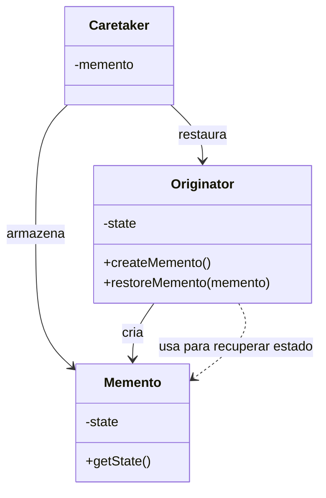

**Data:** 2026-03-11
**Link**: [C# - Apresentando o padrão Memento](https://www.youtube.com/watch?v=WjtiVVcWTB4&list=PLJ4k1IC8GhW1L7fOWe238fetknEfBmG1I&index=23)
**Curso:** Padrões de Projeto
**Professor**: #Jose-Carlos-Macoratti
**Instituição:** #youtube 

**Tags:** #Padrões-Projetos #Programação #Código-Limpo #Boas-Praticas

### Conteúdo
----------------
## Definição

O **Memento** é um padrão comportamental cuja intenção é **capturar e externalizar o estado interno de um objeto sem violar o encapsulamento**, permitindo que esse estado seja restaurado posteriormente.

Em outras palavras, ele permite tirar um **“snapshot” (instantâneo)** do estado de um objeto em determinado momento e recuperá-lo no futuro.

Esse padrão é frequentemente utilizado quando é necessário implementar funcionalidades como:

- **Undo / Redo (desfazer operações)**    
- **Rollback**    
- **Recuperação de falhas**    
- **Histórico de estados de um objeto**    

O ponto principal é que o estado do objeto é armazenado em um objeto externo chamado **Memento**, preservando o princípio do **encapsulamento**.

---
## Diagrama UML

---

# Funcionamento e Conceitos

## Como o padrão funciona

O funcionamento do padrão ocorre basicamente em três etapas:

1. O **Originator** possui um estado interno que pode mudar ao longo do tempo.    
2. Em determinado momento, ele cria um **Memento**, que armazena um snapshot desse estado.    
3. O **Caretaker** guarda esse Memento.    
4. Se for necessário restaurar o estado anterior, o Caretaker devolve o Memento ao Originator, que recupera seu estado original.    

Esse mecanismo permite salvar e restaurar estados **sem expor diretamente a estrutura interna do objeto**.

---

## Papéis e responsabilidades dos participantes

### Originator

É o objeto cujo estado precisa ser salvo.

Responsabilidades:

- Criar o **Memento** contendo uma cópia do seu estado atual.    
- Restaurar seu estado interno a partir de um Memento.    
- Controlar quais dados do estado serão armazenados.    

Na prática, ele representa a **classe principal que queremos preservar ou restaurar**.

---

### Memento

É o objeto que **armazena o estado interno do Originator**.

Responsabilidades:

- Guardar os dados do estado capturado.    
- Proteger o acesso a esse estado para evitar alterações externas.    
- Fornecer meios para que o Originator recupere esse estado posteriormente.    

Ele funciona como um **container de estado**.

---

### Caretaker

Também chamado de **zelador**.

Responsabilidades:

- Armazenar os objetos Memento.    
- Gerenciar os snapshots criados.    
- Entregar o Memento ao Originator quando for necessário restaurar o estado.    

Importante:  
O Caretaker **não pode modificar nem acessar o conteúdo interno do Memento**, apenas armazená-lo.

---

## Quando utilizar

O padrão Memento é indicado quando:

- É necessário **salvar e restaurar o estado de um objeto** posteriormente.    
- Existe a necessidade de implementar **operações de desfazer (undo)**.    
- O estado de um objeto **não pode ser exposto diretamente** por questões de encapsulamento.   
- Deseja-se manter **histórico do ciclo de vida de um objeto**.    

---

## Pontos importantes destacados na aula

Alguns pontos enfatizados na aula:

- O Memento funciona como um **snapshot do estado do objeto**.    
- O estado é armazenado **fora do objeto principal**, mas ainda controlado por ele.    
- O padrão respeita o **encapsulamento**, pois outros objetos não acessam diretamente o estado interno.    
- É possível manter **vários estados armazenados**, permitindo voltar para diferentes momentos do ciclo de vida do objeto.    

---

## Observações práticas no contexto de desenvolvimento em C#

Alguns pontos relevantes no uso prático:

- Pode ser utilizado em aplicações que precisam de **histórico de alterações de objetos**.    
- Em sistemas corporativos pode ser útil para:    
    - controle de alterações em documentos        
    - rollback de operações        
    - histórico de estados de entidades
        
- Em aplicações .NET, o conceito de snapshot pode ser implementado de diversas formas, inclusive usando **serialização** para capturar o estado do objeto.
    
- Deve-se tomar cuidado com **objetos muito grandes**, pois cada snapshot pode consumir memória.    

---

# Vantagens e Desvantagens

## Vantagens

- Preserva o **encapsulamento** do objeto.    
- Permite **restaurar estados anteriores** facilmente.    
- Facilita a implementação de **undo/redo**.    
- Permite manter **histórico do ciclo de vida de um objeto**.    
- Ajuda na **recuperação de falhas** em aplicações.    

---

## Desvantagens

- Pode gerar **alto consumo de memória** se muitos estados forem armazenados.    
- O processo de salvar e restaurar estados pode **impactar o desempenho da aplicação**.    
- Implementações podem se tornar complexas quando o objeto possui **muito estado interno**.    

---

Se quiser, também posso te mostrar **3 exemplos práticos de uso do Memento em sistemas corporativos (inclusive em cenários parecidos com sistemas ECM ou workflow)** — que provavelmente vão fazer muito sentido para o tipo de sistema que você desenvolve.

### Complementos externos
---------
