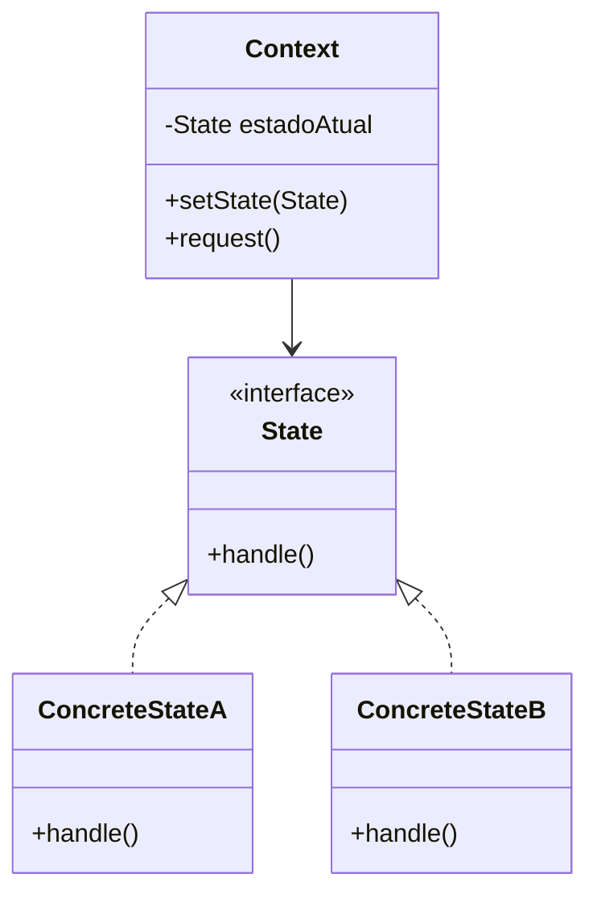

**Data:** 2026-03-18
**Link**: [(526) C# - Apresentando o padrão State - YouTube](https://www.youtube.com/watch?v=w2PtQWTytW8&list=PLJ4k1IC8GhW1L7fOWe238fetknEfBmG1I&index=25)
**Curso:** Padrões de Projeto
**Professor**: #Jose-Carlos-Macoratti
**Instituição:** #youtube 

**Tags:** #Padrões-Projetos #Programação #Código-Limpo #Boas-Praticas

### Conteúdo
----------------
## Definição

O padrão **State** é um padrão comportamental que permite que um objeto altere seu comportamento quando seu **estado interno muda**, dando a impressão de que ele mudou de classe .

Na prática, ele resolve o problema de **código cheio de condicionais (if/switch)** que dependem do estado do objeto. Em vez disso, cada estado é representado por uma classe separada, e o objeto principal (Contexto) delega o comportamento para essas classes .

Esse padrão é muito utilizado para representar **máquinas de estados**, onde o comportamento varia conforme o estado atual (ex: caixa eletrônico, máquina de venda, workflow de documentos).

---
## Diagrama UML

---

## Funcionamento e Conceitos

### Como o padrão funciona

- O objeto principal (**Context**) mantém uma referência para um objeto de estado.    
- Cada estado é representado por uma classe que implementa uma interface comum.    
- O comportamento do contexto é delegado para o estado atual.    
- Quando o estado muda, o contexto passa a usar outra instância de estado.    
- Isso altera o comportamento sem mudar a interface pública do objeto .    

---

### Papéis e responsabilidades

- **Context**
    
    - Mantém o estado atual        
    - Delega comportamento para o estado        
    - Pode controlar ou permitir a troca de estados
        
- **State (interface/abstrata)**
    
    - Define os métodos que representam comportamentos dependentes de estado
        
- **ConcreteState**
    
    - Implementa o comportamento específico de um estado        
    - Pode decidir quando e como ocorre a transição de estado        

---

### Quando utilizar

- Quando um objeto:
    
    - Se comporta de forma diferente dependendo do estado        
    - Possui muitos estados possíveis        
    - Tem lógica baseada em muitos `if` ou `switch`
    
- Quando a lógica de transição de estados muda com frequência
    

---

### Pontos importantes destacados na aula

- O padrão faz parecer que o objeto **mudou de classe**, mas na verdade ele apenas mudou de estado.    
- Evita o uso excessivo de estruturas condicionais (`if`, `switch-case`).    
- Cada estado encapsula seu próprio comportamento.    
- O comportamento muda conforme a **transição de estados internos**.    
- Muito útil para representar fluxos como:
    
    - Máquina de vendas        
    - Caixa eletrônico        
    - Processos com etapas bem definidas        

---

### Observações práticas (C#)

- Normalmente implementado com:
    
    - Interface ou classe abstrata para o **State**        
    - Classes concretas para cada estado
        
- O contexto mantém uma referência para o estado atual.
    
- A troca de estado geralmente ocorre:
    
    - Dentro do próprio contexto        
    - Ou dentro das classes de estado
        
- Muito usado para substituir:
    
    - Lógicas condicionais complexas        
    - Fluxos baseados em status (ex: status de pedido, workflow ECM)
        

👉 No seu cenário (ECM / workflows), esse padrão encaixa perfeitamente para:

- Estados de documentos (Rascunho, Em aprovação, Assinado)    
- Estados de processos (Aberto, Em andamento, Finalizado)
    

---
## Vantagens e Desvantagens

### Vantagens

- Elimina condicionais complexas (`if/switch`)    
- Melhora a coesão (cada estado cuida do seu comportamento)    
- Facilita a extensão (adicionar novos estados é simples)    
- Permite comportamento polimórfico    
- Segue princípios SOLID (SRP e Open/Closed)    

---

### Desvantagens

- Aumenta o número de classes no sistema    
- Pode gerar duplicação de código entre estados    
- Pode ser exagero para cenários simples com poucos estados    

---

Se quiser, posso te mostrar um exemplo prático aplicado exatamente no seu contexto de ECM (tipo documental + workflow), que vai fazer muito sentido com o que você já trabalha.

### Complementos externos
---------
