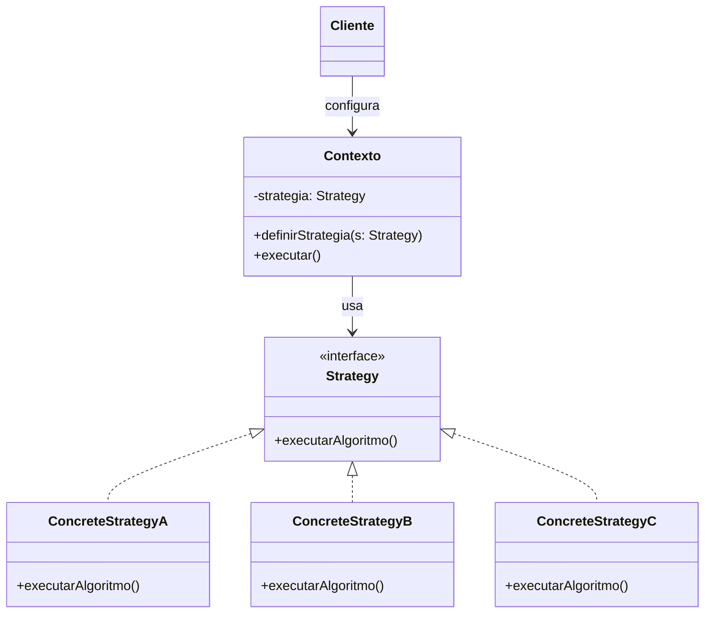

**Data:** 2026-03-19
**Link**: [(531) C# - Apresentando o padrão Strategy - YouTube](https://www.youtube.com/watch?v=u8JG3YVQ06I&list=PLJ4k1IC8GhW1L7fOWe238fetknEfBmG1I&index=26)
**Curso:** Padrões de Projeto
**Professor**: #Jose-Carlos-Macoratti
**Instituição:** #youtube 

**Tags:** #Padrões-Projetos #Programação #Código-Limpo #Boas-Praticas

### Conteúdo
----------------

## Definição

O **Strategy** é um padrão de projeto comportamental que define uma **família de algoritmos**, encapsula cada algoritmo em uma estrutura separada e permite **trocar a estratégia em tempo de execução**, sem alterar o cliente que a utiliza. Na explicação da aula, a ideia central é exatamente esta: escolher entre diferentes soluções para o mesmo problema, decidindo qual usar somente no momento da execução.

Em termos práticos, ele resolve situações em que existe uma tarefa única, mas há **várias formas de executá-la**. Em vez de concentrar tudo em uma única classe com muitos `if/else`, o comportamento variável é extraído para classes separadas, deixando o sistema mais flexível, coeso e fácil de manter.

A transcrição também destaca que esse padrão é muito usado para permitir que o usuário ou a aplicação altere o comportamento de uma classe **sem precisar estendê-la**. Ou seja, em vez de criar subclasses para cada variação, escolhe-se a estratégia adequada por composição.

---
## Diagrama UML

O papel desse diagrama, conforme a aula, é mostrar que o **Contexto** mantém uma referência para a abstração da estratégia, enquanto as estratégias concretas implementam os algoritmos específicos. O cliente decide qual estratégia associar ao contexto.

---
## Funcionamento e Conceitos

### Como o padrão funciona

- Existe um **contexto** que precisa executar um determinado comportamento.    
- Esse comportamento não fica implementado diretamente no contexto.    
- Em vez disso, o contexto delega a execução para um objeto que implementa uma **interface comum de estratégia**.    
- Cada estratégia concreta encapsula uma variação do algoritmo.    
- Em tempo de execução, a aplicação ou o cliente escolhe qual estratégia será usada e pode até substituí-la por outra.    

Na aula, o professor usa a ideia de uma tarefa com três soluções possíveis. Cada solução representa um comportamento diferente, encapsulado em sua própria classe. O cliente escolhe em tempo de execução se usará a solução 1, 2 ou 3. Esse é o coração do Strategy.

### Papéis e responsabilidades dos participantes

**Strategy**

- Define o contrato comum que todas as estratégias devem seguir.    
- Normalmente é representado por uma interface ou classe abstrata.    

**ConcreteStrategy**

- Implementa uma variação específica do algoritmo.    
- Cada classe concreta representa uma solução diferente para o mesmo problema.    

**Contexto**

- Mantém a referência para uma estratégia.    
- Usa a abstração da estratégia para solicitar a execução do comportamento.    
- Não deve depender dos detalhes de implementação das estratégias concretas.    

**Cliente**

- Cria ou escolhe a estratégia concreta apropriada.    
- Injeta essa estratégia no contexto.    
- Pode trocar a estratégia durante a execução, se necessário.    

### Quando utilizar

Use Strategy quando:

- há **muitas classes relacionadas que diferem apenas no comportamento**;    
- você precisa trabalhar com **variantes de um mesmo algoritmo**;    
- existe uma classe com muitos **condicionais para escolher comportamentos**;    
- é necessário trocar a forma de execução de uma tarefa **durante a execução**;    
- deseja-se isolar a lógica do algoritmo do restante da regra de negócio.    

### Pontos importantes destacados na aula

- O padrão encapsula algoritmos em classes diferentes.    
- As estratégias são **intercambiáveis**.    
- A escolha da estratégia ocorre em **tempo de execução**.    
- O algoritmo pode variar independentemente do cliente que o utiliza.    
- O foco é dar flexibilidade sem espalhar condicionais pelo código.    

A aula reforça bastante que o objetivo não é apenas “separar código”, mas permitir a **troca simples entre soluções equivalentes para o mesmo problema**. Isso aparece com clareza no exemplo dos meios de transporte para chegar ao aeroporto: ônibus, carro e táxi resolvem o mesmo problema, mas com custos, conveniência e tempos diferentes.

### Observações práticas relevantes para o contexto de desenvolvimento em C#

No contexto de desenvolvimento em C#, o Strategy se encaixa muito bem quando você quer evitar classes cheias de decisões internas e prefere trabalhar com **interfaces e composição**, algo muito alinhado com boas práticas da plataforma. A própria aula enfatiza que ele orienta a “programar para uma interface” e favorece **alta coesão e baixo acoplamento**.

Na prática, ele é útil quando um serviço precisa variar comportamentos como:

- cálculo de preços, taxas ou descontos;    
- validações com regras diferentes por contexto;    
- formas distintas de processamento de arquivos;    
- políticas de ordenação, filtragem ou compactação;    
- seleção de comportamento com base em configuração ou escolha do usuário.    

O exemplo da aula com compressão de arquivos mostra isso muito bem: a operação é a mesma, mas o algoritmo muda conforme o formato desejado. O contexto apenas usa a estratégia selecionada, sem conhecer a lógica detalhada de cada formato.

Também é importante perceber que, em C#, o Strategy costuma combinar muito bem com injeção de dependência quando a estratégia é conhecida por configuração, mas também pode ser trocado dinamicamente quando a escolha depende de entrada do usuário ou de regras de negócio em tempo real.

---
## Vantagens e Desvantagens

### Vantagens

- Permite **trocar algoritmos durante a execução**.    
- Evita o excesso de condicionais como `if/else` ou `switch`, deixando o código mais claro.    
- Favorece **alta coesão** e **baixo acoplamento**.    
- Incentiva o uso de **composição** em vez de herança.    
- Facilita testes unitários, porque cada algoritmo pode ser testado isoladamente.    
- Atende bem ao princípio **aberto/fechado**, pois novas estratégias podem ser adicionadas sem mudar o contexto.    
### Desvantagens

- Pode aumentar o número de classes no projeto.    
- O cliente ou a aplicação precisa conhecer as estratégias disponíveis para escolher a mais adequada.    
- Em cenários simples, com poucas variações, o padrão pode introduzir complexidade desnecessária.    
- A configuração do contexto e da estratégia pode exigir mais objetos e mais coordenação da aplicação.    

---
## Síntese prática

O **Strategy** é ideal quando você tem **uma mesma intenção de negócio**, mas **múltiplas formas de executar a solução**. Em vez de concentrar essas variações dentro da mesma classe, você separa cada algoritmo em uma estratégia própria e deixa o contexto trabalhar apenas com a abstração. Isso torna o código mais limpo, extensível e fácil de evoluir, especialmente em aplicações C# que valorizam interfaces, composição e separação clara de responsabilidades.

Fontes base: transcrição da aula e material complementar do site

### Complementos externos
---------
