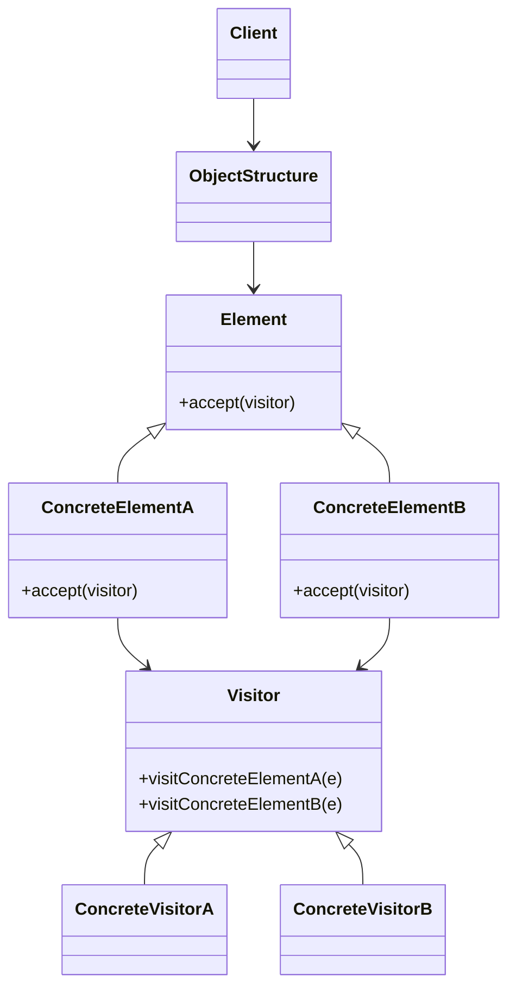

**Data:** 2026-03-24
**Link**: [C# - Apresentando o padrão Visitor](https://www.youtube.com/watch?v=73cWZcJozVs&list=PLJ4k1IC8GhW1L7fOWe238fetknEfBmG1I&index=28)
**Curso:** Padrões de Projeto
**Professor**: #Jose-Carlos-Macoratti
**Instituição:** #youtube 

**Tags:** #Padrões-Projetos #Programação #Código-Limpo #Boas-Praticas

### Conteúdo
----------------
## Visitor

### Definição

O padrão **Visitor** é um padrão comportamental que permite **definir novas operações sobre uma estrutura de objetos sem modificar as classes desses objetos**.

Ele separa os algoritmos da estrutura de dados, permitindo adicionar novos comportamentos criando novas classes visitantes, sem alterar as classes existentes.

Esse padrão é especialmente útil quando:

- A estrutura de objetos é estável    
- Mas as operações sobre essa estrutura mudam frequentemente    

---
### Diagrama UML

---

### Funcionamento e Conceitos

#### Como o padrão funciona

- Cada elemento da estrutura possui um método `accept`    
- O cliente envia um visitante para os elementos    
- O elemento delega a execução para o visitante correto    
- O visitante executa a operação específica para aquele tipo de elemento    

Esse processo utiliza **Double Dispatch**, permitindo escolher o método correto sem condicionais complexas.

---

#### Papéis e responsabilidades

- **Visitor (Visitante)**    
    - Define métodos para cada tipo de elemento        
- **ConcreteVisitor**    
    - Implementa as operações específicas (ex: exportação, cálculo, relatório)        
- **Element**    
    - Define o método `accept(visitor)`        
- **ConcreteElement**    
    - Implementa `accept` chamando o método correto do visitante        
- **ObjectStructure**    
    - Estrutura que contém os elementos (lista, árvore, etc.)        
- **Client**    
    - Cria o visitante e percorre os elementos        

---
#### Quando utilizar

- Quando você precisa adicionar novas operações sem alterar classes existentes    
- Quando há **muitas operações diferentes** sobre a mesma estrutura    
- Quando a estrutura de classes é estável, mas o comportamento varia    
- Quando deseja evitar múltiplos `if/switch` baseados em tipo    

---
#### Pontos importantes destacados na aula

- O Visitor permite **adicionar comportamento sem alterar a classe original**, respeitando o princípio aberto/fechado    
- Cada nova funcionalidade exige **um novo Visitor**    
- É comum em estruturas complexas (listas, árvores, coleções)    
- Não é um padrão muito utilizado devido à **complexidade e aplicabilidade limitada**    
- Evita lógica de verificação de tipo (ex: `switch` ou `instanceof`)    

---
#### Observações práticas (C#)

- Muito útil quando você **não pode alterar classes existentes** (ex: bibliotecas, legado)    
- Pode ser aplicado em:
    
    - Processamento de coleções heterogêneas        
    - Geração de relatórios        
    - Cálculos variados sobre objetos
        
- Em C#, o padrão funciona bem com:
    
    - Interfaces        
    - Polimorfismo        
    - Sobrecarga de métodos (mas depende do double dispatch)
        
- Atenção:
    
    - Pode aumentar bastante a quantidade de classes no projeto        
    - Pode dificultar a leitura se mal organizado        

---

### Vantagens e Desvantagens

#### Vantagens

- Segue o **Princípio Aberto/Fechado**    
- Separa responsabilidades (SRP)    
- Facilita adicionar novas operações    
- Evita modificações em classes estáveis    
- Centraliza regras de negócio relacionadas a uma operação    

---
#### Desvantagens

- Aumenta a complexidade do sistema    
- Exige criação de várias classes visitantes    
- Dificulta quando novos tipos de elementos são adicionados    
- Pode quebrar encapsulamento (necessidade de acesso a dados internos)    
- Código pode ficar espalhado entre vários Visitors    

---
Se quiser, posso te dar um exemplo prático bem próximo do seu contexto (ECM ou processamento de documentos) — esse padrão encaixa muito bem nesses cenários.

### Complementos externos
---------
