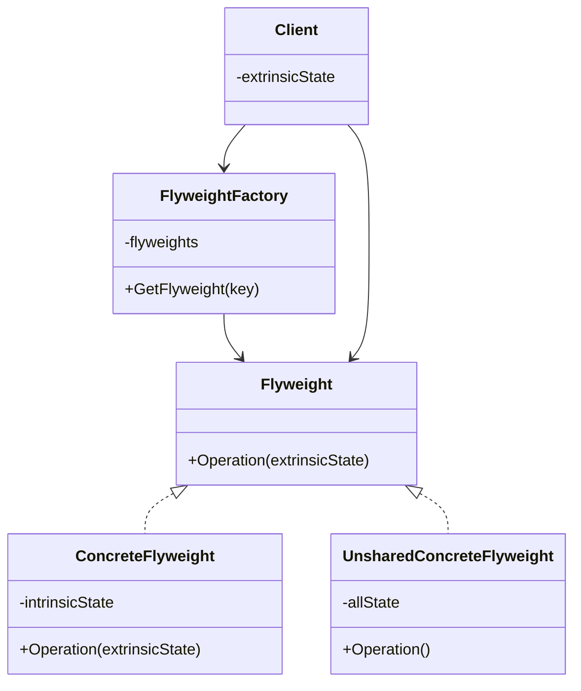

**Data:** 2026-02-17
**Link**:[C# - Apresentando o Padrão Flyweight](https://www.youtube.com/watch?v=B4OPckrTBM0&t=1s)
**Curso:** Padrões de Projeto
**Professor**: #Jose-Carlos-Macoratti
**Instituição:** #youtube 

**Tags:** #Padrões-Projetos #Programação #Código-Limpo #Boas-Praticas
### Conteúdo
----------------

## Definição

O **Flyweight** (também conhecido como _Peso Mosca_) é um padrão estrutural cujo objetivo é **reduzir o consumo de memória** ao permitir o **compartilhamento de partes comuns do estado entre múltiplos objetos semelhantes**.

Segundo a aula, ele é utilizado quando há necessidade de criar **um grande número de objetos parecidos**, e essa criação massiva passa a consumir muita memória, impactando desempenho e escalabilidade

A ideia central do padrão é separar o estado do objeto em duas partes:

- **Estado Intrínseco** → Parte fixa, constante e compartilhável.    
- **Estado Extrínseco** → Parte variável, dependente do contexto e atribuída em tempo de execução.

Ao compartilhar o estado intrínseco entre várias instâncias, reduzimos drasticamente a quantidade de objetos pesados criados em memória

---
## Diagrama UML

---

## Funcionamento e Conceitos

### Como o padrão funciona

- Identifica-se uma classe que gera **muitos objetos semelhantes**.    
- Divide-se o estado da classe em:    
    - Parte **imutável e compartilhável** (intrínseca).        
    - Parte **variável e contextual** (extrínseca).
    
- A parte intrínseca permanece dentro do objeto Flyweight.    
- A parte extrínseca **não é armazenada no objeto**, sendo fornecida externamente no momento da execução.    
- Uma **Factory** controla a criação e reutilização dos objetos compartilhados.    

Na aula, o exemplo clássico é o de milhares de objetos “Círculo”, onde:

- Forma, coordenadas e raio são **intrínsecos**.    
- Cor é **extrínseca** e atribuída em tempo de execução

---
### Papéis e responsabilidades dos participantes

#### Flyweight (Interface)

- Define o contrato comum.    
- Permite que os objetos sejam tratados de forma uniforme.    

#### ConcreteFlyweight

- Implementa a interface.    
- Armazena apenas o **estado intrínseco**.    
- Deve ser compartilhável.    

#### UnsharedConcreteFlyweight (opcional)

- Não é compartilhado.    
- Utilizado apenas quando necessário, dependendo dos requisitos.    

#### FlyweightFactory

- Cria e gerencia os objetos Flyweight.    
- Garante que:    
    - Se o objeto já existir, ele é reutilizado.        
    - Caso contrário, é criado e armazenado.
    
- Normalmente utiliza uma estrutura de cache (como um dicionário) para armazenar instâncias
  

> Importante: Apesar de usar uma fábrica, **não deve ser confundido com o padrão Factory Method**.

#### Client

- Mantém ou calcula o estado extrínseco.    
- Solicita objetos à fábrica.    
- Fornece o estado extrínseco no momento da chamada.    

---

### Quando utilizar

O Flyweight deve ser considerado quando:

- A aplicação precisa criar **muitos objetos semelhantes**.    
- O consumo de memória começa a se tornar um problema.    
- Existem **dados duplicados** que podem ser extraídos e compartilhados    
- Objetos compartilhados podem substituir com facilidade múltiplas instâncias independentes
    

⚠ Segundo o material, o Flyweight é uma **otimização**. Só deve ser aplicado quando houver um problema real de consumo de memória

---

### Pontos importantes destacados na aula

- A chave do padrão está na distinção clara entre **estado intrínseco e extrínseco**
- O estado intrínseco:
    
    - É constante.        
    - Fica armazenado no cache.        
    - É compartilhado.
        
- O estado extrínseco:
    
    - Varia.        
    - É atribuído em tempo de execução.        
    - Não deve ser armazenado no objeto compartilhado.
        
- A fábrica reutiliza objetos existentes sempre que possível.    
- O padrão tem **escopo reduzido** e só traz benefícios tangíveis em cenários específicos

---
### Observações práticas relevantes para C#

- Em C#, normalmente a fábrica utiliza:
    
    - `Dictionary<TKey, TValue>` para cache.        
    - Métodos estáticos para acesso centralizado.
        
- O estado intrínseco deve ser tratado como **imutável**.
    
    - Evite propriedades públicas com setter.        
    - Inicialize o estado apenas no construtor
        
- Ideal para cenários como:
    
    - Sistemas gráficos.        
    - Renderização de elementos repetitivos.        
    - Jogos.        
    - Sistemas que manipulam grandes volumes de objetos em memória.
        
- Deve-se avaliar o custo adicional de:
    
    - Passagem de parâmetros extrínsecos.        
    - Sincronização em cenários concorrentes.        

---

## Vantagens e Desvantagens

### Vantagens

- Reduz significativamente o uso de memória
- Melhora o desempenho ao diminuir a criação de objetos pesados.    
- Favorece o uso de cache.    
- Permite suportar grande quantidade de objetos simultaneamente.

---
### Desvantagens

- Aumenta a complexidade do código
- Introduz custo adicional em tempo de execução:    
    - Cálculo e passagem do estado extrínseco
        
- Pode trocar economia de RAM por maior uso de CPU
- Pode dificultar a compreensão para novos membros da equipe.    

---
## Conclusão

O Flyweight é um padrão voltado para **eficiência de memória**. Ele não melhora diretamente a modelagem do domínio, mas sim a performance estrutural da aplicação.

Seu uso é altamente estratégico: quando aplicado corretamente em cenários com grande volume de objetos similares, pode trazer ganhos significativos. Fora desse contexto, tende a aumentar complexidade sem benefícios reais.

A decisão de aplicá-lo deve ser baseada em análise concreta de consumo de memória e não apenas por elegância arquitetural.

### Complementos externos
---------
